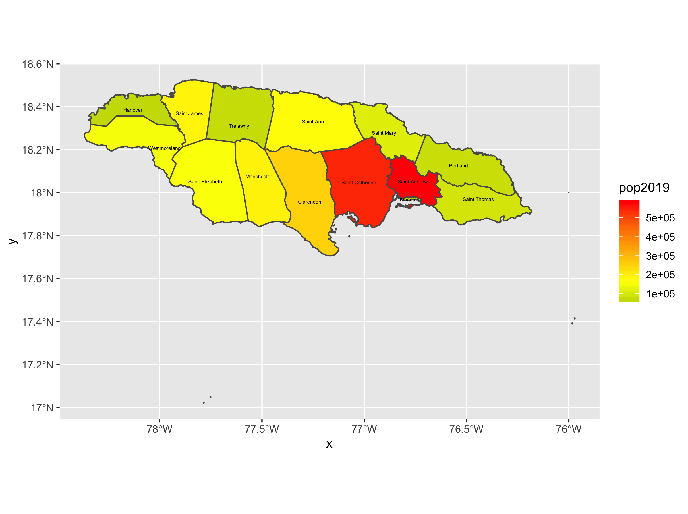

# Project 1: Jamaica

Henry Buron

## Parish Borders and Healthsites (Part 1 - Stretch Goal)

## Population by Parish (Part 2)

## 3D Population Plot (Part 2 - Stretch Goal(.mp4 file))

## Spatial Description and Geometric Bar Plot (Part 3)

For part one, I did not have much difficulty creating the plot. However, if I were to do it again, I would spend some time figuring out how to move individual administrative 1 labels (rather than all at once). Most of these Parish names are easy to read, however if you look to the West and see Westmorland, or down South towards Kingston, you'll notice that some are partially obscured by boundary lines. However, overall, Part 1 went well and I was even able to include red crosses to indicate health sites, as one of the stretch goals. For part two, I was able to create the normal plot and also a 3D version. I made a few small errors, like not typing in the color gradient command correctly (turns out I didn't include the fill = pop2019 command), but because Jamaica is only ~5 million grid cells, I was able to make many minor modifications to the code and quickly reload the plot to see what worked. I had some trouble figuring out how to render the file to create the 3D plot, but luckily I was sitting next to Sayeed and he helped me troubleshoot that. Part 3 was probably the most difficult for me. For the longest time, I could not figure out why the color gradient command was not applying to my bar graph, but eventually I realized it was because I was missing a "+". After that, I didn't have any difficult creating the spatial plot, but I had trouble combining the plots with the ggarrange command. I thought the problem was that I had not correctly installed the ggpubr package, but I eventually realized that it was because I hadn't set the spatial plot equal to the correct type of variable. Once I did, however, I was able to easily combine the plots.
